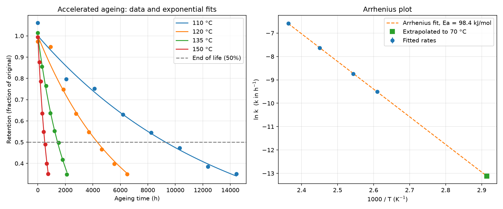
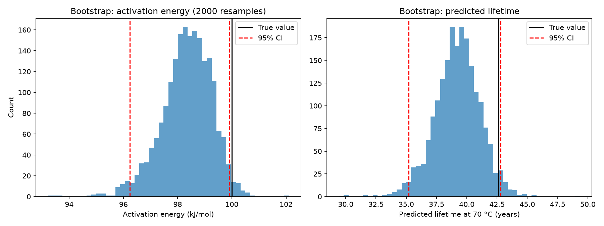
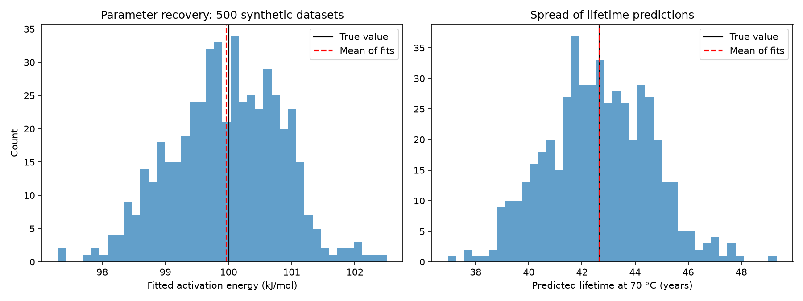

# Arrhenius Ageing and Lifetime Prediction Model

Predicts the service lifetime of a material from accelerated ageing data at high temperatures, using the Arrhenius equation to extrapolate down to service temperature. Includes bootstrap uncertainty analysis and a parameter recovery study to validate the method.

The setting is based on polymer cable insulation in nuclear plants, which has to last decades at moderate temperatures. Because you can't test for 40 years, samples are aged hot to speed up degradation, and the results are extrapolated.

## Method

1. **Synthetic data** – accelerated ageing data is generated at 110, 120, 135 and 150 °C from known "true" parameters (Ea = 100 kJ/mol), with 3% measurement noise. Using synthetic data means the true answer is known, so the method can be checked.
2. **Degradation rates** – retention is modelled as exponential decay, R(t) = exp(−kt), and k is fitted at each temperature by non-linear least squares (SciPy `curve_fit`).
3. **Arrhenius fit** – ln k is plotted against 1/T. The slope gives the activation energy, since k = A·exp(−Ea/RT).
4. **Lifetime prediction** – end of life is taken as 50% retention. The fitted Ea and A are used to predict the lifetime at a service temperature of 70 °C.
5. **Bootstrap** – the measurements are resampled with replacement 2,000 times and refitted, giving 95% confidence intervals on Ea and lifetime.
6. **Parameter recovery** – 500 fresh synthetic datasets are generated and fitted, to check the method is unbiased and to measure the true spread of results.

## Results

### Fit and Arrhenius plot

The exponential fits match the data at all four temperatures, and the rates fall on a straight Arrhenius line. The fitted activation energy is 98.4 kJ/mol, against the true 100 kJ/mol.

### Bootstrap uncertainty

The predicted lifetime at 70 °C has a median of 39.3 years (95% CI 35.2–42.8 years), which contains the true lifetime of 42.6 years. The activation energy has a median of 98.4 kJ/mol (95% CI 96.2–99.9 kJ/mol), so the true value of 100 kJ/mol fell just outside its interval, which led to the recovery study below.

### Parameter recovery

Across 500 synthetic datasets:
- Mean fitted Ea = 99.96 kJ/mol (bias −0.04%), standard deviation 0.86 kJ/mol
- Mean predicted lifetime = 42.6 years (true 42.6), standard deviation 1.9 years

So the method is unbiased, and the bootstrap interval width matches the real spread. The original dataset was just an unlucky draw, about 1.9 standard deviations low, which is expected about 1 time in 20 for a 95% interval.

The key result is how uncertainty grows during extrapolation. Ea varies by only about ±2%, but the predicted lifetime varies by about ±9%, because the service temperature is a long way from the test temperatures.

## Limitations

- The data is synthetic, and real ageing data has extra scatter and sometimes non-Arrhenius behaviour (for example, a change in degradation mechanism at lower temperatures, which would make extrapolation unreliable).
- Simple first-order (exponential) degradation is assumed.
- The end-of-life criterion (50% retention) is a simplification.

## Next steps

- Fit real published accelerated ageing data
- Test for non-Arrhenius behaviour by comparing fits over different temperature ranges
- Fit all temperatures in one global non-linear model instead of the two-step approach

## Files

- `generate_data.py` – creates synthetic accelerated ageing data
- `arrhenius_fit.py` – fits degradation rates, Arrhenius plot and lifetime prediction
- `bootstrap.py` – bootstrap uncertainty on Ea and lifetime
- `recovery.py` – parameter recovery study over 500 synthetic datasets

## How to run

Requires Python 3 with NumPy, SciPy, pandas and Matplotlib.

    py generate_data.py
    py arrhenius_fit.py
    py bootstrap.py
    py recovery.py